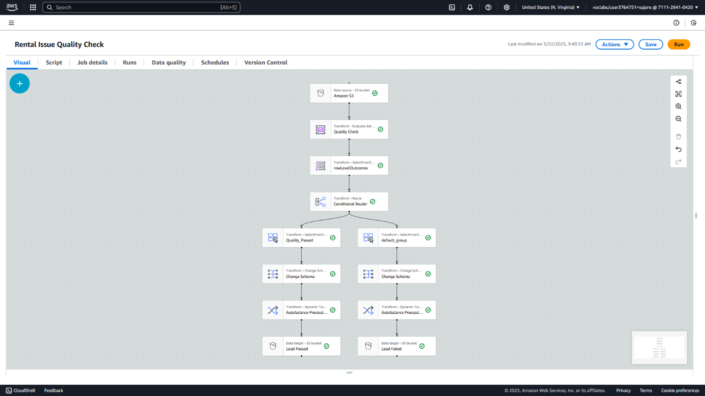
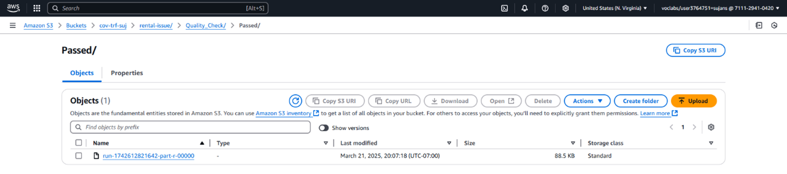
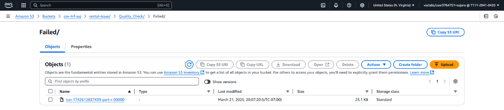
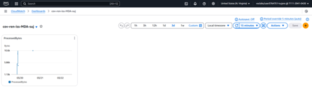

# 🧪 Data Quality Control: Ensuring Clean and Reliable Data for the City of Vancouver

## 📘 Project Description

This project establishes a robust **Data Quality Control (DQC)** framework as part of the Data Analytics Platform (DAP) for the City of Vancouver. The aim is to ensure the **accuracy, completeness, uniqueness**, and **consistency** of the dataset — enabling high-confidence insights for policy-making and public transparency.

---

## 🏷️ Project Title

**Implementation of Data Quality Control Measures for Rental Standards Data – City of Vancouver**

---

## 🎯 Objective

To implement data quality control techniques using rule-based validation pipelines and continuous monitoring mechanisms, ensuring that the rental dataset adheres to high standards of **data integrity**, **reliability**, and **consistency**.

---

## 🏙️ Background

As the City of Vancouver transitions into cloud-based analytics, maintaining data quality has become crucial. The dataset — which includes rental violations and complaints — often contains:
- Duplicates
- Missing or incomplete fields
- Inconsistent formats

This initiative implements **automated validation**, **real-time quality metrics**, and **visual dashboards** to govern and enhance dataset integrity.

---

## 📌 Scope

This DQC framework includes:

- **Data Profiling** – Initial quality analysis
- **Data Cleansing** – Removing or correcting flawed entries
- **Validation** – Automated rule-based checks
- **Monitoring & Reporting** – Dashboards for real-time oversight
- **Governance & Awareness** – Implementation via ETL and role-based visibility

---

## ⚙️ Methodology

### 1. 🔍 Current State Assessment

- Analyzed the raw dataset structure, volume, and frequency of ingestion.
- Identified `GeoLocalArea`, `StreetNumber`, and `TotalOutstanding` as critical fields.
- Focused on evaluating duplication issues in categorical fields and null entries.

---

### 2. 📊 Data Profiling

- Used **AWS Glue DataBrew** for initial profiling
- Key insights:
  - `StreetNumber` had duplicate instances
  - ~1% missing values in `GeoLocalArea`
  - Fields were predominantly `String` and `Double`

---

### 3. 🎯 Establishing Data Quality Metrics

Defined custom metrics to evaluate the dataset:

| Metric         | Target Threshold | Rule Applied                          |
|----------------|------------------|----------------------------------------|
| **Uniqueness** | ≥ 80%            | `Uniqueness("streetNumber") > 0.80`    |
| **Completeness** | ~100%           | Checked null ratio in required columns |
| **Freshness**  | Not applicable   | Due to lack of timestamp in dataset    |

---

### 4. 🧹 Data Cleansing Process

Handled during DataBrew transformation:
- Removed nulls from `GeoLocalArea`
- Converted all columns to **CamelCase**
- Trimmed whitespaces
- Standardized categorical formats

---

### 5. ✅ Validation Rules and ETL Pipeline

Built a visual **ETL pipeline in AWS Glue** for validation using the following steps:

#### 🔁 Evaluate Quality Check Pipeline

1. **Extract**: Data pulled from transformed S3 bucket  
2. **Evaluate**: Applied uniqueness rule on `StreetNumber`  
3. **Result Column**: Added `evaluation_result` status (`Passed` or `Default`)  
4. **Conditional Routing**: Filtered based on evaluation result  
5. **Split Output**: Segregated data into `passed` and `default` branches  
6. **Drop Columns**: Removed unnecessary metadata  
7. **Auto-Balancing**: Optimized for partitioning  
8. **Load**: Exported to S3 with separate folders for each result

⬇️ **Screenshot**: Rental Issue Quality Check ETL  

⬇️ **Screenshot**: Quality Check Result  

⬇️ **Screenshot**: Passed and Failed Folders  
  

---

### 6. 📊 Monitoring and Reporting

A set of **monitoring dashboards** were created using **AWS CloudWatch** to visualize data quality performance and AWS resource usage.

#### 🧭 Dashboards Created

| Dashboard | Monitors                             |
|-----------|---------------------------------------|
| **MDQ**   | Quality Check status (Pass/Fail)      |

⬇️ **Screenshot**: Dashboard Overview  

The dashboards provide a centralized view of data flow, pipeline health, and quality compliance.

---

## 🧰 Tools & Technologies

| Tool                  | Purpose                                  |
|-----------------------|------------------------------------------|
| **AWS Glue ETL**      | Visual ETL for evaluating data rules     |
| **Amazon S3**         | Raw and cleaned data storage             |
| **AWS CloudWatch**    | Monitoring job runs and performance      |
| **DataBrew**          | Profiling & transformation               |
| **CSV/Parquet Outputs**| Final validated datasets                |

---

## 📦 Deliverables

- ✅ ETL pipeline for rule-based data quality validation  
- 📊 Quality Check reports (Passed/Default segregation)  
- 🖼️ Dashboard with real-time monitoring of data metrics  
- 📝 Full documentation of data quality rules, thresholds, and output structure  

---

## 📅 Timeline

| Phase                 | Duration |
|-----------------------|----------|
| Profiling & Metrics   | Week 1   |
| ETL Development       | Week 2   |
| Output Segregation    | Week 3   |
| Monitoring Dashboards | Week 4   |

---

## 📌 Conclusion

This Data Quality Control implementation provides the City of Vancouver with a strong foundation for maintaining trusted, validated datasets. By combining rule-based validation, segregated output pipelines, and monitoring dashboards, the platform ensures scalable and transparent data governance across departments.
