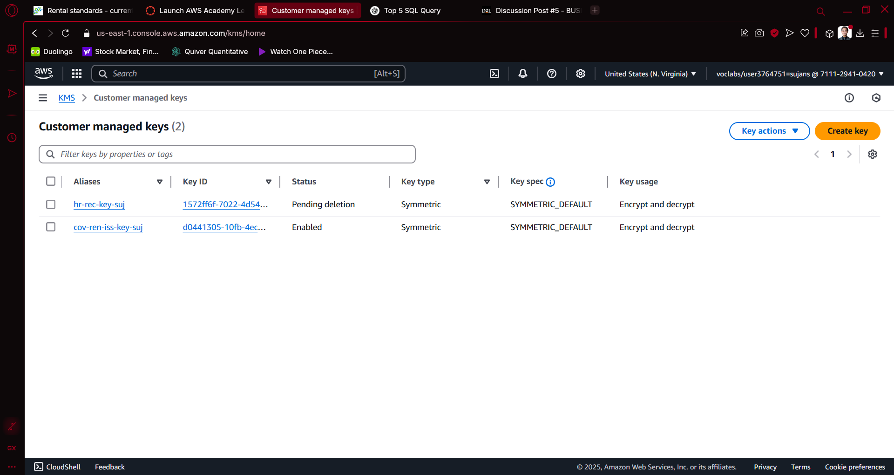
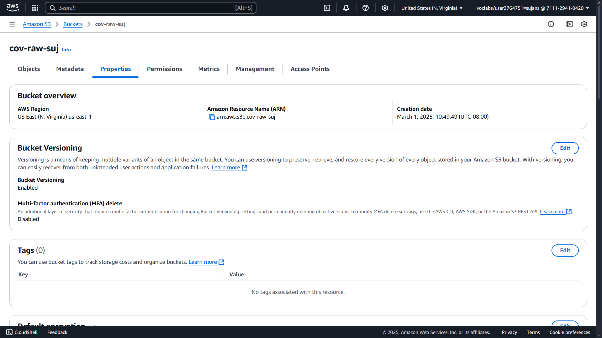
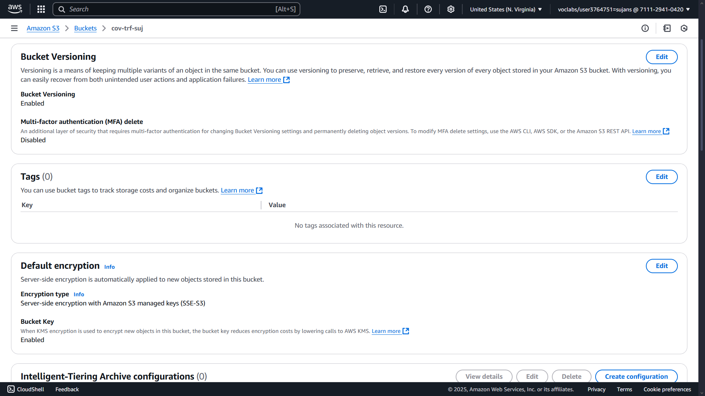
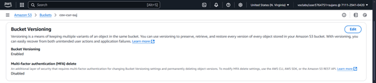
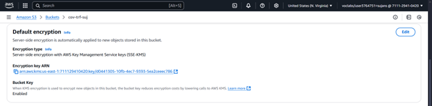
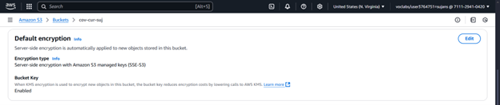
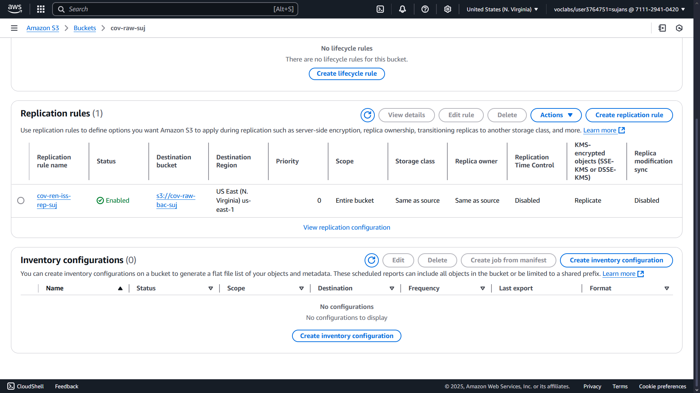
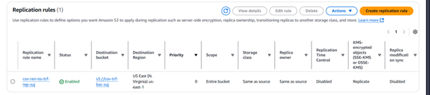
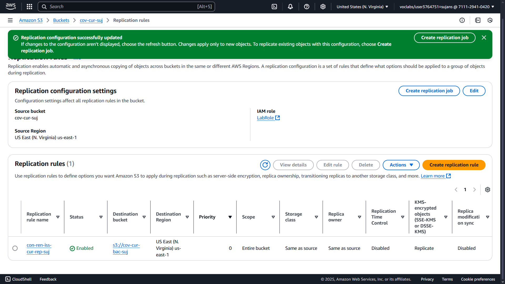

# 🔐 Data Security: Protecting Cloud-Based Data for the City of Vancouver

## 📘 Project Description

This section focuses on implementing robust data security mechanisms as part of the City of Vancouver’s Data Analytics Platform (DAP) on AWS. It ensures **confidentiality**, **integrity**, and **availability** of data using services like **AWS KMS**, **S3 Bucket Encryption**, **Versioning**, and **Replication**.

---

## 🛡️ Key Security Objectives

- 🔑 Encrypt sensitive datasets using AWS Key Management Service (KMS)
- 📥 Enable version control for backup and recovery
- 🔁 Replicate data across buckets to ensure high availability
- 🔐 Apply encryption across all environments: raw, transformed, and curated

---

## 🔑 AWS KMS: Key Management System

**AWS KMS** allows the creation and management of encryption keys used to secure data in S3 and other services.

- A symmetric key was created named: `cov-ren-iss-key-suj`
- The key is assigned to a specific IAM role (`LabRole`)
- All encryption and decryption operations use this centralized key
- This prevents unauthorized access to data at rest or in transit

⬇️ KMS Key Creation  

## ♻️ S3 Bucket Versioning

**Bucket Versioning** enables storing multiple versions of objects in an S3 bucket. This helps in:

- Protecting against accidental deletions  
- Recovering overwritten data  
- Maintaining a history of changes  

### 🪣 Enabled for the Following Buckets:

1. **Raw Bucket**

⬇️ Raw Bucket Versioning  

2. **Transformed Bucket**

⬇️ Transformed Bucket Versioning  

3. **Curated Bucket**

⬇️ Curated Bucket Versioning  

---

## 🔐 S3 Encryption using Custom KMS Key

Once the key (`cov-ren-iss-key-suj`) was created, encryption was applied to all buckets and their backups using **SSE-KMS (Server-Side Encryption with KMS)**.

### ✅ Applied Encryption To:

1. **Raw Bucket**

⬇️ Raw Bucket Encryption  

2. **Transformed Bucket**

⬇️ Transformed Bucket Encryption  

3. **Curated Bucket**

⬇️ Curated Bucket Encryption  

---

## 🔁 Cross-Bucket Replication

To maintain **high availability** and **durability**, **replication rules** were applied to all core buckets. This ensures that if one bucket fails or becomes unavailable, a backup exists in a different S3 location.

- Replication helps with disaster recovery (DR)  
- Custom rules applied to **Raw**, **Transformed**, and **Curated** buckets individually  
- Allows setting different storage classes for future optimization  

### 🔁 Enabled Replication On:

1. **Raw Bucket**

⬇️ Raw Bucket Replication  

2. **Transformed Bucket**

⬇️ Transformed Bucket Replication  

3. **Curated Bucket**

⬇️ Curated Bucket Replication  

---

## 🧰 Tools & Technologies

| Service             | Purpose                                      |
|---------------------|----------------------------------------------|
| **AWS KMS**         | Key generation for encryption/decryption     |
| **Amazon S3**       | Primary data storage                         |
| **S3 Versioning**   | Protect against accidental loss              |
| **S3 Replication**  | Cross-bucket backups for high availability   |
| **SSE-KMS**         | Encryption with custom KMS keys              |

---

## 📌 Conclusion

The data security infrastructure for the City of Vancouver’s analytics platform is built on industry-standard AWS best practices. By combining encryption, versioning, and replication — and managing access with IAM roles — this architecture ensures that rental data is **confidential**, **recoverable**, and **always available**. 

