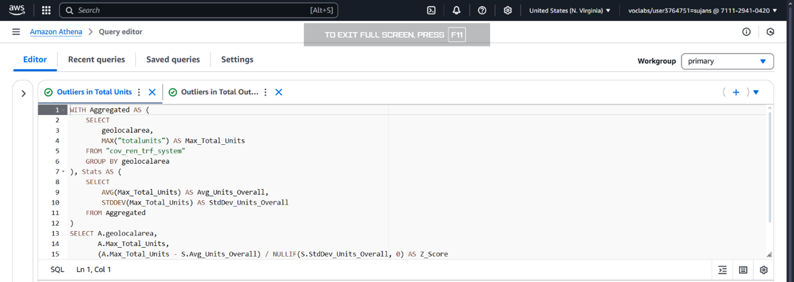
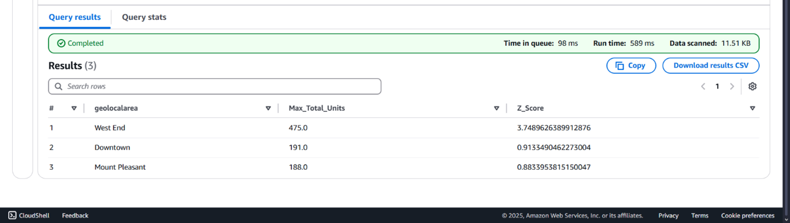
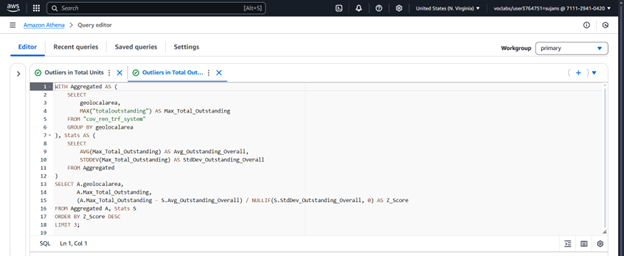
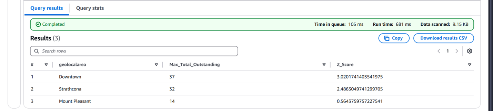

# 🩺 Diagnostic Analysis of Rental Outliers in the City of Vancouver

## 📘 Project Description

This project focuses on identifying potential **data anomalies and outliers** in the Rental Standard Current Issues dataset provided by the City of Vancouver. Using **Amazon Athena**, a serverless SQL query engine, we analyzed records directly from Amazon S3 to investigate **whether outliers may be skewing average-based summaries** used in earlier descriptive analysis.

---

## 🏷️ Project Title

**Outlier Detection in Geo Local Areas Using Z-Score Analysis on Rental Data**

---

## 🎯 Objective

To conduct a diagnostic analysis on the rental dataset by identifying Geo Local Areas with **extreme Total Units or Total Outstanding rental issues** that may distort data insights. This aims to inform urban planning and policy decisions more accurately by separating real-world issues from data irregularities.

---

## 🏙️ Background

In earlier descriptive analysis, we reported that **Killarney, West End, and Downtown** had some of the highest average Total Units and Total Outstanding Issues. However, there was a concern that these averages might be **misleading due to the presence of outliers**.

To validate this, we used **Z-Score statistical techniques in Athena** to identify anomalies that lie far from the population mean. The goal is to determine if the trends are genuine or affected by extreme values.

---

## 📊 Dataset

- **Source**: [City of Vancouver Open Data Portal]([https://opendata.vancouver.ca](https://opendata.vancouver.ca/explore/dataset/rental-standards-current-issues/information/))
- **Title**: Rental Standard Current Issues
- **License**: Open Government Licence – Vancouver
- **Fields Used**:
  - `GeoLocalArea`
  - `TotalUnits`
  - `TotalOutstanding`

---

## ⚙️ Methodology

### 1. Data Collection and Preparation
- Dataset uploaded and transformed using **AWS Glue DataBrew**
- Cleaned data stored in **Amazon S3 transformed bucket**
- Cataloged via **AWS Glue Crawler**, and queried using **Amazon Athena**

### 2. Outlier Detection Using Z-Score
- Applied Z-Score calculation via SQL queries in Athena to evaluate distance from the mean for:
  - `TotalUnits`
  - `TotalOutstanding`

### 3. Analysis of Results
- Investigated Geo Local Areas with Z-scores > 3
- Assessed whether anomalies stemmed from real-world density or data quality issues

---

## 🧪 Z-Score Query Samples

### 🔍 Total Units Z-Score Query

### 🧾 SQL Query Execution Screenshot



```sql
WITH Aggregated AS (
    SELECT 
        geolocalarea, 
        MAX("totalunits") AS Max_Total_Units
    FROM "cov_ren_trf_system" 
    GROUP BY geolocalarea
), Stats AS (
    SELECT 
        AVG(Max_Total_Units) AS Avg_Units_Overall,
        STDDEV(Max_Total_Units) AS StdDev_Units_Overall
    FROM Aggregated
)
SELECT A.geolocalarea, 
       A.Max_Total_Units,
       (A.Max_Total_Units - S.Avg_Units_Overall) / NULLIF(S.StdDev_Units_Overall, 0) AS Z_Score
FROM Aggregated A, Stats S
ORDER BY Z_Score DESC
LIMIT 3;
```
### 🧾 SQL Query Execution Result Screenshot



### ✅ Insight

- **West End** had a **Z-score of 3.74**, indicating a potential outlier.
- This could be:
  - A genuine high-density housing zone
  - Or a few records skewing the average

---

### 🔍 Total Outstanding Issues Z-Score Query

### 🧾 SQL Query Execution Screenshot



```sql
WITH Aggregated AS (
    SELECT 
        geolocalarea, 
        MAX("totaloutstanding") AS Max_Total_Outstanding
    FROM "cov_ren_trf_system" 
    GROUP BY geolocalarea
), Stats AS (
    SELECT 
        AVG(Max_Total_Outstanding) AS Avg_Outstanding_Overall,
        STDDEV(Max_Total_Outstanding) AS StdDev_Outstanding_Overall
    FROM Aggregated
)
SELECT A.geolocalarea, 
       A.Max_Total_Outstanding,
       (A.Max_Total_Outstanding - S.Avg_Outstanding_Overall) / NULLIF(S.StdDev_Outstanding_Overall, 0) AS Z_Score
FROM Aggregated A, Stats S
ORDER BY Z_Score DESC
LIMIT 3;
```
### 🧾 SQL Query Execution Result Screenshot



### ✅ Insight

- **Downtown** and **Strathcona** showed **very high Z-scores** for Total Outstanding.
- Possible reasons:
  - 🛠️ Data entry issues (duplicates, incorrect values)
  - 📈 Real-world rental problem concentration

---

### ⚠️ Diagnostic Outcomes

| Area        | Z-Score | Possible Cause                      |
|-------------|---------|--------------------------------------|
| West End (Total Units)   | 3.74    | Density skew or data outlier         |
| Strathcona (Total Outstanding) | High    | Systemic issue or duplicate          |
| Downtown (Total Outstanding)  | High    | Repeated reports or high severity    |

---

### 🔁 Root Cause Possibilities

#### 🧩 Scenario 1: Data Issues

- Incorrect value imputation  
- Duplicate records  
- Reporting errors  

#### 📍 Scenario 2: Real Urban Trends

- High density or policy delays  
- Systemic maintenance neglect in specific areas  

> 📝 _Further analysis (e.g., feedback logs, survey data, or time-series trends) would help validate either direction._

---

### 🧰 Tools & Technologies

| Tool                 | Purpose                                       |
|----------------------|-----------------------------------------------|
| **Amazon S3**        | Storage for raw/transformed data              |
| **AWS Glue / DataBrew** | Data cleaning, profiling, and schema setup |
| **Amazon Athena**    | SQL queries on S3 data                        |
| **Z-Score (Stat)**   | Outlier detection via standard deviation      |

---

### 📦 Deliverables

- 📄 Diagnostic Report (this file)  
- 📸 Athena query screenshots (`/diagnostic-analysis/screenshots/`)  
- ✅ Z-Score results tables  
- 🧠 Actionable insights for refining descriptive analysis  
- ✏️ Suggestions for deeper root cause investigations  

---

### 📅 Timeline

| Phase                | Duration |
|----------------------|----------|
| Data Prep & Cleaning | Week 1   |
| Z-Score Querying     | Week 2   |
| Insight Validation   | Week 3   |
| Report Writing       | Week 4   |

---

### 📌 Conclusion

This diagnostic analysis confirmed the presence of outliers in the rental dataset that could have skewed earlier insights. While some deviations represent true patterns (e.g., West End's high density), others require further investigation. Identifying and addressing such issues enhances data integrity and supports more accurate decision-making in urban planning for the City of Vancouver.
